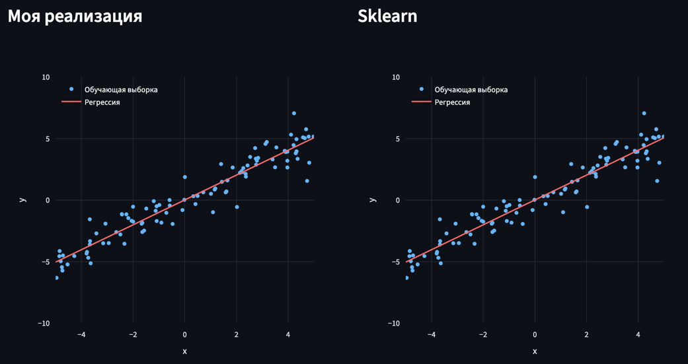
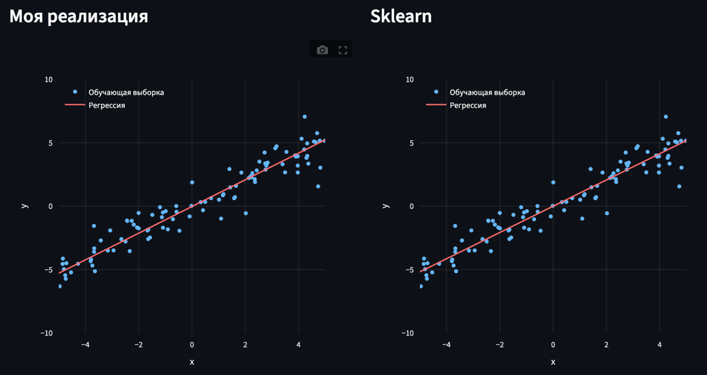
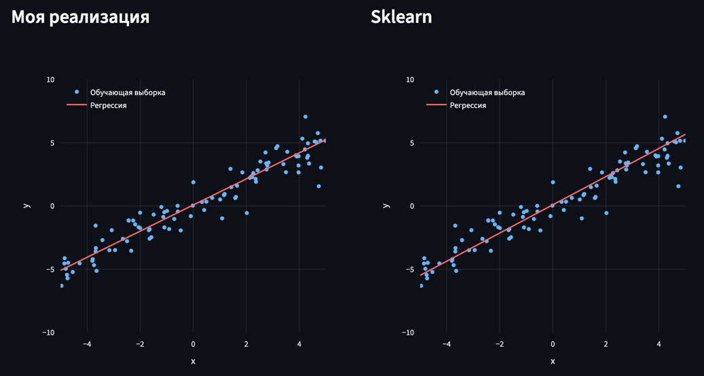
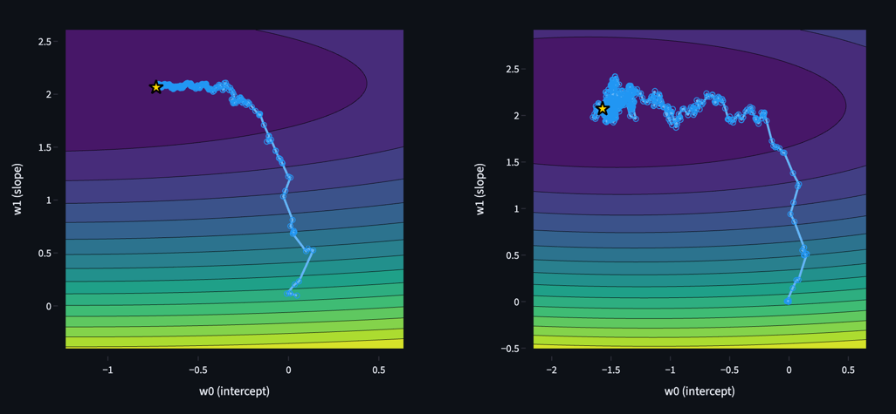

# Linear regressions from scratch

## Установка и запуск локально

Шаги:

```bash
# клонировать репозиторий
git clone https://github.com/vladlenblch/linear_regressions_from_scratch
cd linear_regressions_from_scratch

# создать виртуальное окружение
python -m venv .venv
source .venv/bin/activate

# установить зависимости
pip install -r requirements.txt

# запустить приложение
streamlit run app.py
```

Приложение откроется по адресу http://localhost:8501.

## О проекте

В этом проекте реализованы 3 линейные регрессии (каждый вид реализован с нуля и в виде обертки над `scikit-learn`). 
Для каждой регрессии предоставлен график, а под ним уравнение регрессии и значение функции потерь. 

1) OLS – минимизация MSE через аналитическое решение 



2) MAE – минимизация MAE через subgradient descent



3) SGD – стохастический градиентный спуск для MSE




## Технологический стек и требования

- `Python 3.13+`
- `Streamlit 1.30.0+`
- `NumPy 1.21.0+`
- `Plotly 5.0.0+`
- `scikit-learn 1.0.0+`

## Структура репозитория

- `computations/` – операции с матрицами
- `my_models/` – собственные реализации регрессоров
- `sklearn_models/` – обертки над `scikit-learn` для сравнения
- `utils/` – генерация данных и метрики
- `visualization/` – отрисовка графиков
- `app.py` – приложение (точка входа в программу)
- `requirements.txt` – зависимости проекта
- `README.md` – текстовое описание проекта
